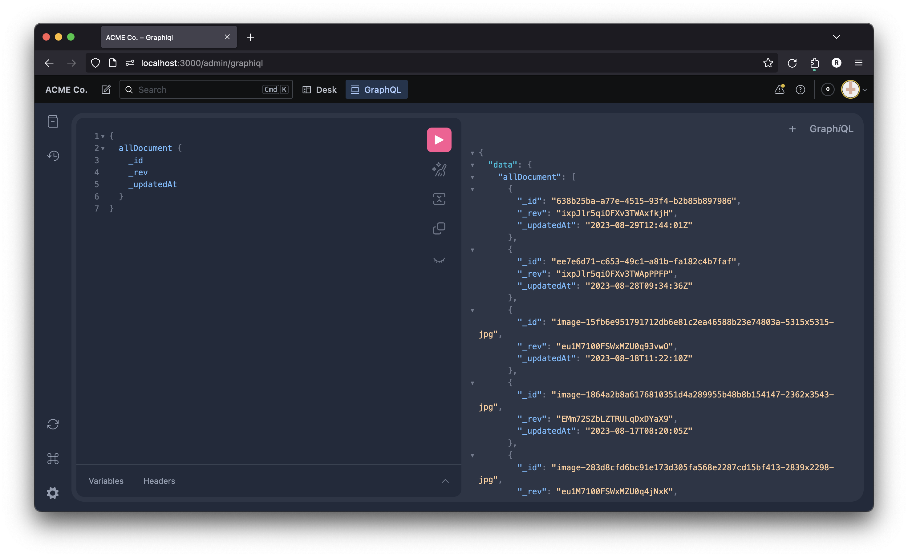

# sanity-plugin-graphiql

[](https://www.npmjs.com/package/sanity-plugin-graphiql)
[](https://www.npmjs.com/package/sanity-plugin-graphiql)

[](https://github.com/romeovs/sanity-plugin-graphiql/actions/workflows/main.yml)

> This is a **Sanity Studio v3** plugin.

Add GraphiQL to your Sanity Studio.



## Installation

```sh
npm install sanity-plugin-graphiql
```

## Usage

Add it as a plugin in `sanity.config.ts` (or .js):

```ts
import {defineConfig} from 'sanity'
import {graphiQLTool} from 'sanity-plugin-graphiql'

export default defineConfig({
  //...
  plugins: [
    graphiQLTool({
      apiVersion: '2021-10-21',

      // if you want to use a GraphQL api that is
      // not a Sanity GraphQL API, you can hardcode the url.
      url: 'https://www.example.com/api/my/graphql',

      // override the default tool name
      name: 'graphiql',

      // override the default tool title
      title: 'GraphiQL',

      // override the default tool icon
      icon: BlockElementIcon,
    }),
  ],
})
```

### Options

The following options are required to set up the tool:

- `apiVersion` **required**: the version of the sanity API used for fetching GraphQL metadata
- `url`: set a custom GraphQL api. This removes the ability to select the url from the tool.
- `name`: set a custom name for the tool. (default: `graphiql`)
- `title`: set a custom name for the tool. (default: `GraphiQL`)
- `icon`: set a custom name for the tool. (default: `"@sanity/icons".BlockElementIcon`)

## License

[MIT](LICENSE) © Romeo Van Snick

## Develop & test

This plugin uses [@sanity/plugin-kit](https://github.com/sanity-io/plugin-kit)
with default configuration for build & watch scripts.

See [Testing a plugin in Sanity Studio](https://github.com/sanity-io/plugin-kit#testing-a-plugin-in-sanity-studio)
on how to run this plugin with hotreload in the studio.

### Release new version

Run ["CI & Release" workflow](https://github.com/romeovs/sanity-plugin-graphiql/actions/workflows/main.yml).
Make sure to select the main branch and check "Release new version".

Semantic release will only release on configured branches, so it is safe to run release on any branch.
